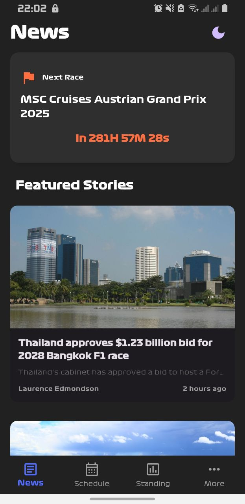
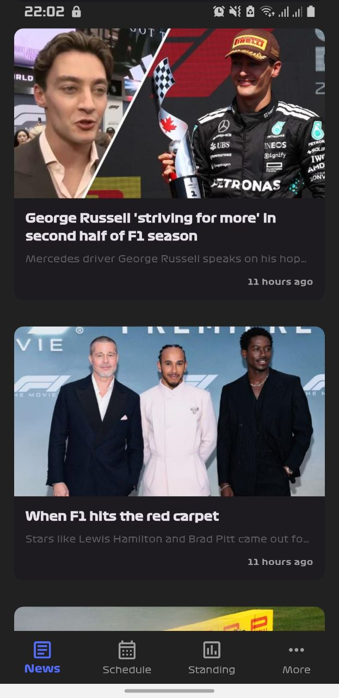
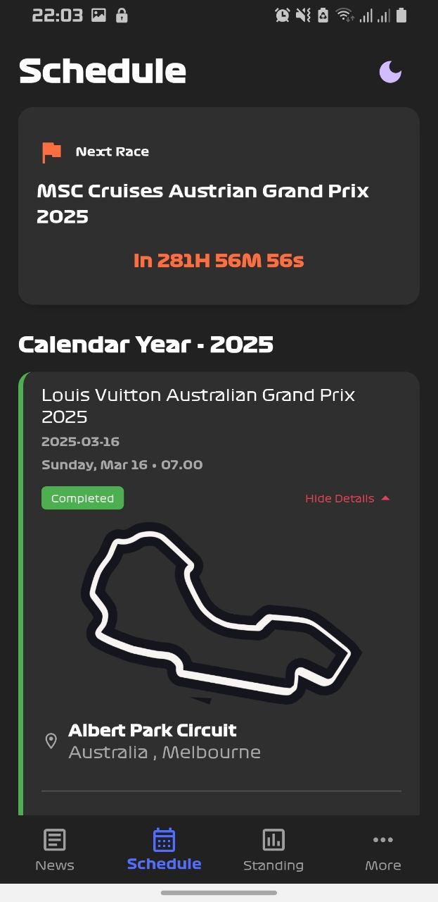
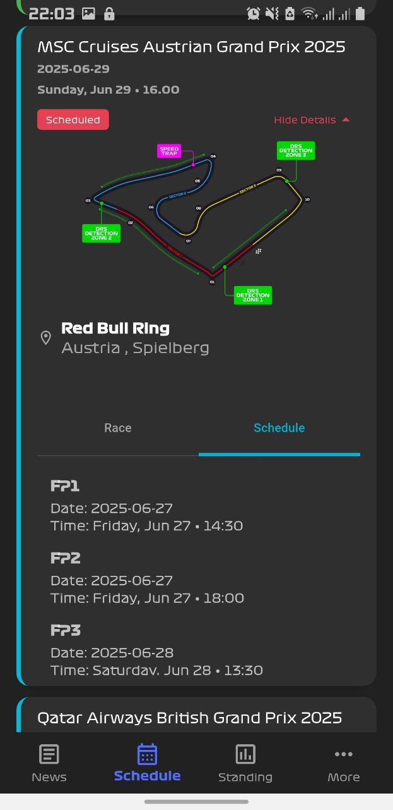
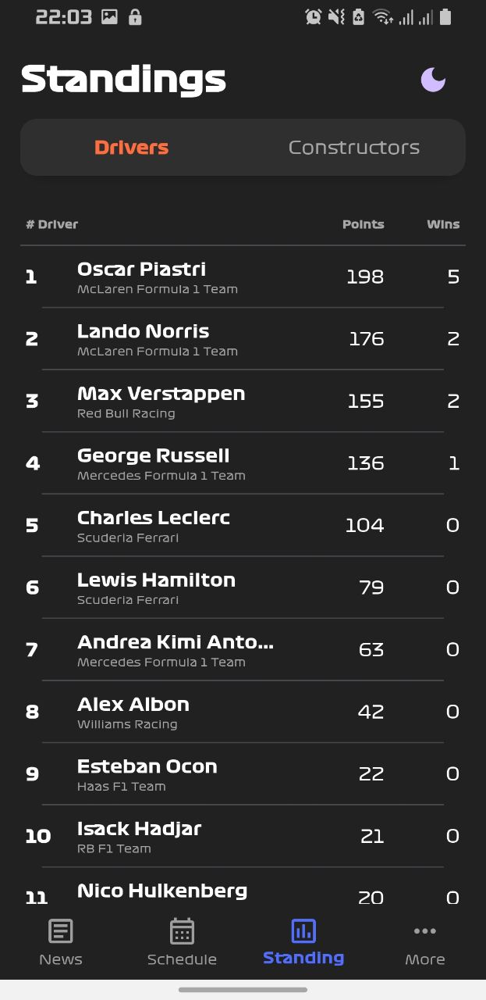
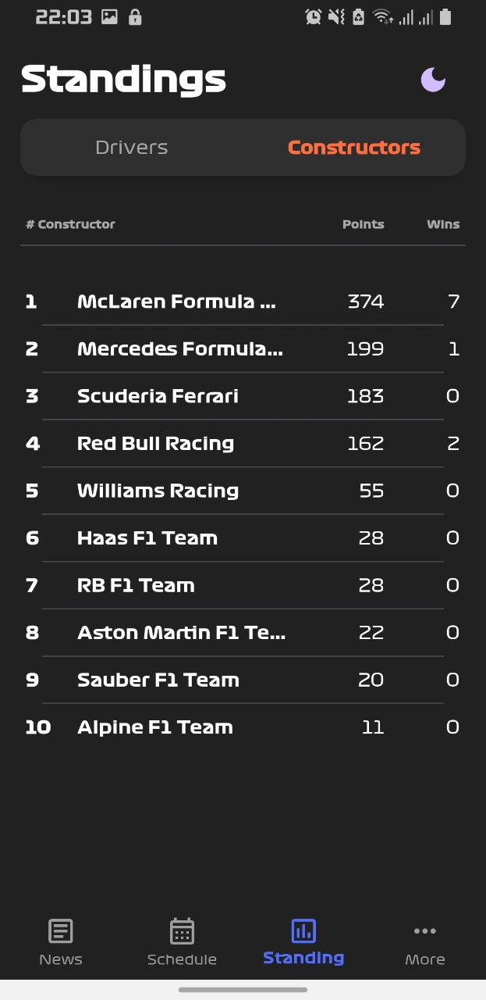
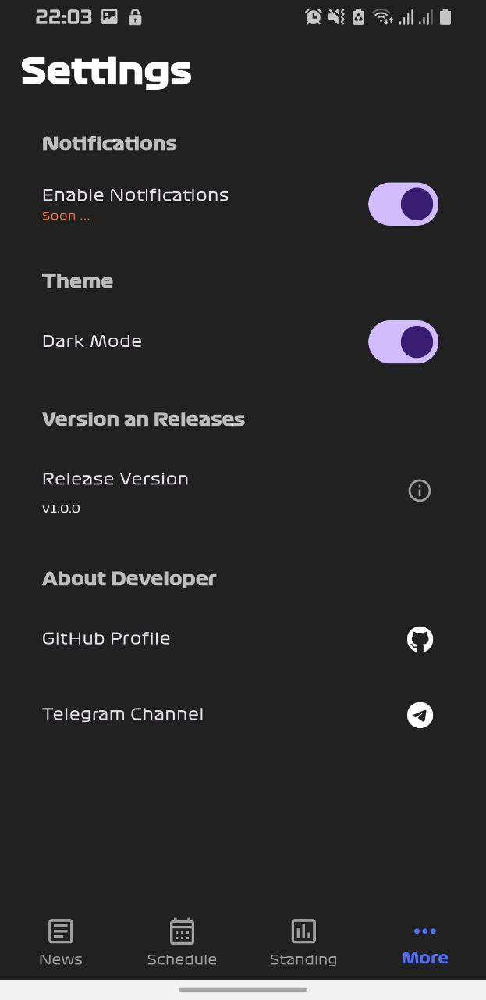

# 🏎️ F1 Hub

Hi everyone! 👋  
I created **F1 Hub** out of my passion for Formula 1 racing. This app is designed to deliver the current, basic, and essential info every F1 fan needs — not everything, but the key stuff that matters most. And yes, it’s built with Flutter.

---

## 🚀 Features

- ⌛ **Next Race Countdown** — never miss the lights out
- 📰 **Featured & Hottest News** — stay up to date with full story coverage
- 📆 **Schedule** — completed and upcoming races, all in one place
- 🏁 **Results** — race results
- 🗺 **Tracks & Circuit Visuals** — get to know the race locations
- 📊 **Constructors & Drivers Standing** — see who’s leading the championship
- 🏁 **Live Driver Standings**: See driver positions, teams, points, and wins.

- 🌗 **Dark Mode Support**: Easy toggle between light and dark themes.

- ⚠️ **Error Handling & Retry**: Friendly error messages with a retry button.
- 🔄 **Pull to Refresh**: Manually refresh the latest standings.

---

## 📸 Screenshots

<table>
  <tr>
    <td align="center">
      
    </td>
    <td align="center">
      
    </td>
    <td align="center">
      
    </td>
  </tr>
  <tr>
    <td align="center">
      
    </td>
    <td align="center">
      
    </td> 
    <td align="center">
      
    </td>

  </tr>

   <tr>
    <td align="center">
      
    </td>

  </tr>
</table>

---

## ⭐ Show Your Support!

If you loved **F1 Hub** , please take a moment to **star** the repo on GitHub! 🌟

Thank you for your support! 🙌❤️

---

## 🌞 Stay Tuned for More!

This app is just getting started! I’m excited to bring you more cool features like:

- Live race telemetry and lap times ⏱️
- Push notifications for race updates 🔔
- Detailed driver and team stats 📊
- Interactive track maps and layouts 🗺️
- widgets

---

Btw i'm team LH .....🏁🏎️💨
